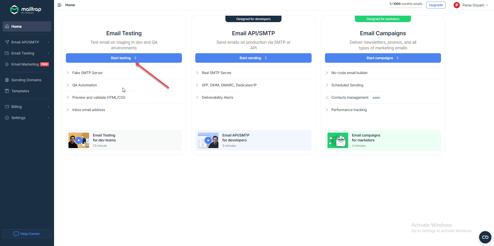
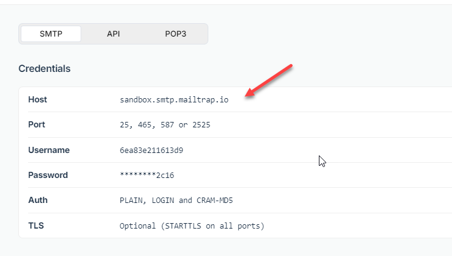
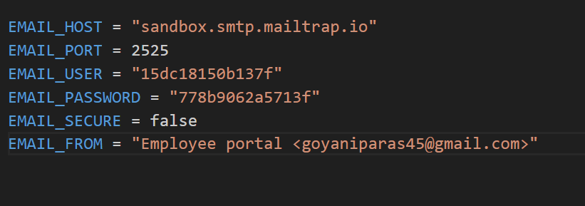

## Configure your SMTP to test 2FA and other email feature

### Step 1: Register on mailtrap.io
### Step 2: Copy your credentials and pate it into `.env` file

### Step 1: Register on mailtrap.io

- Visit [https://mailtrap.io/](https://mailtrap.io/)
- Register your-self,
- In the dashboard, Click on Email testing 
    

### Step 2: Copy your credentials and pate it into `.env` file
- Update the configuration to setup SMPT credentials
    
    
    
